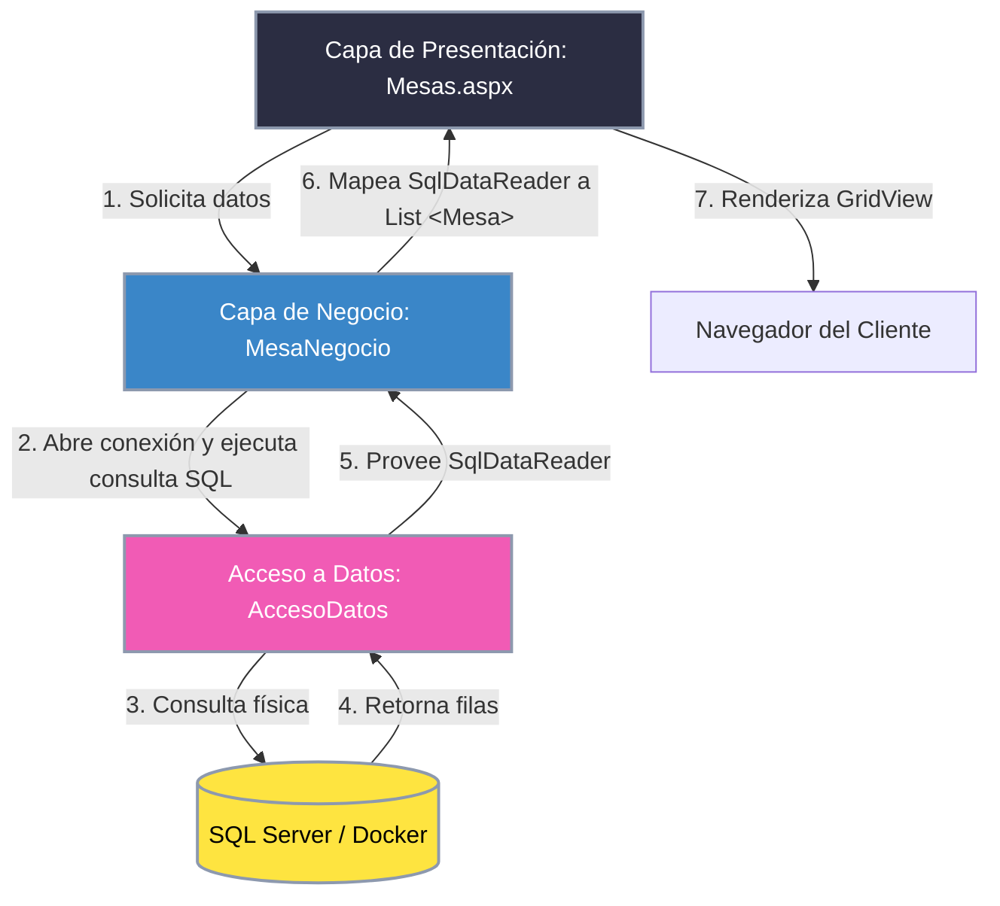

# TPI Programación III - Resto Bar

Este proyecto consiste en una aplicación web diseñada para la gestión integral de los pedidos y las mesas de un restaurante o resto bar. La aplicación está pensada para organizar el flujo de trabajo diario entre los distintos integrantes del local (Gerente, Meseros y Cocina) mediante una interfaz accesible con control de perfiles y seguridad.

---

## Descripción General

El sistema permite administrar de manera ágil el estado de las mesas del salón, la toma de pedidos, la comunicación en tiempo real con la cocina y la visualización de reportes diarios. 

La seguridad de la aplicación está resuelta mediante un sistema de inicio de sesión con usuario y contraseña, asignando a cada persona un rol específico que limita las pantallas y acciones a las que puede acceder.

---

## Perfiles de Usuario

El sistema cuenta con tres perfiles bien diferenciados:

*   **Gerente:** Posee acceso total a todas las funcionalidades del sistema. Su rol es puramente administrativo (no opera como mesero ni personal de cocina). Se encarga de dar de alta nuevos usuarios, asignarles sus perfiles, administrar el catálogo de insumos (platos y bebidas), gestionar los precios, controlar el stock, cerrar/cobrar pedidos del salón y visualizar los reportes finales al cierre de la jornada.
*   **Mesero/a:** Es el encargado del servicio en el salón. Puede visualizar el estado 2D de las mesas, realizar la apertura de nuevos pedidos asignándoles un mesero activo, registrar el consumo de los clientes agregando insumos en tiempo real, y recibir avisos visuales cuando las comandas estén listas en la cocina.
*   **Cocina:** Trabaja en el sector de la cocina. El sistema les muestra una pantalla específica con las comandas pendientes. Al comenzar y finalizar la preparación de una comanda, actualizan su estado para notificar de manera automática al mesero correspondiente.

---

## Dinámica de Funcionamiento del Sistema

### 1. Mesas y Asignación
Al inicio del día, el **Gerente** administra las mesas y el personal en el panel de administración.
*   Esta configuración se puede modificar o reasignar en cualquier momento del día si es necesario.
*   Al abrir un pedido para una mesa libre, el mesero asigna al responsable del servicio seleccionándolo de la lista de personal activo, vinculando todos los consumos a dicho mesero.
*   Todos los pedidos realizados durante la jornada quedan vinculados directamente al mesero asignado a la orden.

### 2. Gestión de Pedidos
*   Cada mesa puede tener un **único pedido activo** a la vez.
*   A lo largo del día, una misma mesa puede abrir y cerrar pedidos múltiples veces (distintas rondas de clientes que ocupen el lugar).
*   **Apertura del pedido:** El mesero inicia el pedido para su mesa seleccionando el mesero responsable y añade los platos y bebidas que pidan los comensales.
*   **Cierre del pedido:** Al finalizar el servicio, el Gerente realiza el cierre y cobro del pedido. Esto calcula el total de consumos acumulados, genera el ticket/cuenta, efectúa el cobro y libera la mesa de forma automática.

### 3. Insumos (Platos y Bebidas)
*   El catálogo de insumos es administrado únicamente por el **Gerente**, quien puede agregar nuevos platos/bebidas, modificar sus precios y reponer la cantidad disponible.
*   Cada insumo tiene asociado un **Nombre, un Precio y una Cantidad en Stock**.
*   El stock se descuenta de forma automática cuando un mesero agrega un ítem a un pedido. Si el stock de un insumo llega a cero, el sistema bloquea su selección para nuevos pedidos.

### 4. Flujo de Cocina
*   Al registrarse una comanda, los platos y bebidas solicitados se envían automáticamente al sector de cocina.
*   El personal de cocina visualiza las comandas pendientes en su pantalla específica (`Cocina.aspx`) y las toma manualmente (modelo Pull) para iniciar su preparación.
*   El estado de la comanda en cocina sigue un ciclo de vida claro:
    *   **Pendiente:** Enviada a cocina y a la espera de ser tomada para su preparación.
    *   **En Preparación:** El personal de cocina inició la elaboración de los ítems de la comanda. El mesero puede ver que la comanda está en proceso.
    *   **Listo:** Se finalizó la preparación de todos los platos de la comanda. Esto alerta inmediatamente al mesero para que vaya a retirarla.
    *   **Entregado:** El mesero confirma la entrega de la comanda en la mesa, dando por concluida la trazabilidad de ese envío.

### 5. Reportes de Gestión
Los reportes son visuales y permiten al **Gerente** evaluar el rendimiento del negocio.
*   **Cierre de día:** El gerente realiza el cierre de la jornada para consolidar la facturación y habilitar las estadísticas completas del día.
*   **Filtro por fecha:** Permite consultar reportes históricos filtrando por días específicos.
*   **Reportes Disponibles:**
    *   Pedidos totales por mesa.
    *   Pedidos atendidos por cada mesero/a.
    *   Comandas completadas por el sector de cocina.

---

## Escenario de Ejemplo: Mesa 5 (2 personas)

Para comprender mejor la lógica de negocio y la secuencia de pasos dentro del sistema, a continuación se detalla un escenario práctico de uso:

### Paso 1: El Mesero abre la mesa
Llega la familia a la Mesa 5. El mesero la selecciona en el sistema y hace clic en **"Abrir Mesa"**.
* **Lógica de negocio:**
  * La Mesa 5 cambia su estado a `Ocupada`.
  * Se genera una nueva instancia de **Pedido**:
    * **Id:** `1001` (autogenerado por la base de datos).
    * **Mesa:** Mesa 5.
    * **Mesero:** Juan (el usuario logueado).
    * **FechaHora:** `2026-06-11 21:00` (hora en que se sentaron).
    * **Estado:** `EstadoPedido.Abierto`.
    * **Total:** `0.00` (inicialmente).

### Paso 2: El Mesero toma el pedido (Ronda 1: Comidas y Bebidas)
A las 21:05, el cliente pide *1 Milanesa con papas* y *1 Coca-Cola*. El mesero lo registra en su pantalla y presiona **"Enviar a Cocina"**.
* **Lógica de negocio:**
  * Se genera una instancia de **Comanda** asociada al Pedido:
    * **Id:** `5001` (autogenerado).
    * **Pedido:** Pedido 1001.
    * **FechaHora:** `2026-06-11 21:05` (hora en que se mandó a marchar).
    * **Estado:** `EstadoDetalle.Pendiente` (entra en cola de cocina).
    * **Observaciones:** *"Traer la gaseosa rápido por favor"*.
  * Se generan dos filas de **DetallePedido** asociadas a la Comanda 5001:
    * **Detalle 1:** Insumo: *Milanesa*, Cantidad: 1, PrecioUnitario: `4500.00`.
    * **Detalle 2:** Insumo: *Coca-Cola*, Cantidad: 1, PrecioUnitario: `1200.00`.

### Paso 3: El Cocinero ve el ticket en la pantalla de cocina
En la pantalla de cocina (`Cocina.aspx`), al personal de cocina le aparece una tarjeta de la Comanda 5001 en estado **Pendiente**.
* **Control del tiempo:** El sistema compara la hora actual (21:10) con la hora de la comanda (21:05) y muestra: *"Tiempo de espera: 5 minutos"*.
* Se lee la nota general (*"Traer la gaseosa rápido por favor"*). El cocinero presiona **"Empezar preparación"**.
* **Lógica de negocio:**
  * La Comanda 5001 se actualiza:
    * **Estado:** `EstadoDetalle.EnPreparacion`.
  * La gaseosa (que se sirve en barra) se marca como servida por el mozo, o la cocina prepara la comida.

### Paso 4: La comida está lista
A las 21:20, se termina la preparación de la comanda y se presiona **"Completar"** en la pantalla de cocina.
* **Lógica de negocio:**
  * La Comanda 5001 se actualiza:
    * **Estado:** `EstadoDetalle.Listo`.
  * El sistema dispara una alerta visual en la pantalla de los meseros: *"Mesa 5 Comida lista para retirar"*.

### Paso 5: El Mesero sirve la comida
El mesero Juan retira la comanda de la cocina, la lleva a la Mesa 5 y, desde su dispositivo, confirma la entrega presionando **"Entregado"**.
* **Lógica de negocio:**
  * La Comanda 5001 se actualiza:
    * **Estado:** `EstadoDetalle.Entregado`.

### Paso 6: Los clientes piden postre (Ronda 2 - Opcional)
A las 21:40, la mesa decide pedir *1 Tiramisú*. El mesero toma el pedido y lo envía.
* **Lógica de negocio:**
  * Se genera una segunda **Comanda** asociada al mismo pedido:
    * **Id:** `5002` (autogenerada).
    * **Pedido:** Pedido 1001.
    * **FechaHora:** `2026-06-11 21:40`.
    * **Estado:** `EstadoDetalle.Pendiente`.
  * Se genera una línea en **DetallePedido** asociada a la Comanda 5002:
    * **Detalle 3:** Insumo: *Tiramisú*, Cantidad: 1, PrecioUnitario: `2500.00`.
  * El flujo de preparación de la cocina se repite para la Comanda 5002.

### Paso 7: Cierre y Facturación
A las 22:00, los clientes piden la cuenta. El Gerente presiona **"Cerrar y Cobrar"** en la pantalla de Pedidos.
* **Lógica de negocio:**
  * El sistema busca el Pedido abierto de la Mesa 5 (que es el Pedido 1001).
  * Realiza una consulta SQL para traer todos los detalles de todas las comandas asociadas a ese pedido:
    * Trae Detalle 1 (`$4500.00`), Detalle 2 (`$1200.00`) y Detalle 3 (`$2500.00`).
  * El sistema calcula el Total: `$4500.00 + $1200.00 + $2500.00 = $8200.00`.
  * Se genera el ticket de cobro por `$8200.00`.
  * Una vez registrado el pago:
    * El Pedido 1001 se actualiza:
      * **Total:** `8200.00`.
      * **Estado:** `EstadoPedido.Cerrado`.
    * La Mesa 5 se actualiza:
      * **Estado:** `EstadoMesa.Libre`.
      * **Mesero asignado:** `null` (disponible para el siguiente turno).

---

## Arquitectura y Diseño Técnico

El sistema está diseñado bajo un esquema de **Arquitectura en Capas (N-Tier)** para desacoplar la interfaz de usuario, las reglas de negocio y el acceso físico a los datos.

### Estructura de Capas y Responsabilidades

| Capa | Proyecto / Carpeta | Responsabilidad Principal | Clases Clave |
| :--- | :--- | :--- | :--- |
| **Presentación** | `tpi-progra3-G16A` | Interfaz gráfica Web Forms (.aspx). Captura eventos del usuario y delega la ejecución de lógica. | `Default.aspx`, `Mesas.aspx`, `Pedidos.aspx`, `Cocina.aspx`, `Reportes.aspx` |
| **Negocio (BLL)** | `negocio` | Implementa las reglas del dominio y coordina las operaciones CRUD y de control. | [InsumoNegocio](file:///c:/Users/julia/Documents/UTN%20FRGP/Programacion%203/tpi-progra3-G16A/negocio/InsumoNegocio.cs), [MesaNegocio](file:///c:/Users/julia/Documents/UTN%20FRGP/Programacion%203/tpi-progra3-G16A/negocio/MesaNegocio.cs), [UsuarioNegocio](file:///c:/Users/julia/Documents/UTN%20FRGP/Programacion%203/tpi-progra3-G16A/negocio/UsuarioNegocio.cs), [ReporteNegocio](file:///c:/Users/julia/Documents/UTN%20FRGP/Programacion%203/tpi-progra3-G16A/negocio/ReporteNegocio.cs) |
| **Acceso a Datos (DAL)** | `negocio/AccesoDatos.cs` | Centraliza la conexión a SQL Server y la ejecución de comandos parametrizados (ADO.NET). | [AccesoDatos](file:///c:/Users/julia/Documents/UTN%20FRGP/Programacion%203/tpi-progra3-G16A/negocio/AccesoDatos.cs) |
| **Dominio (Entidades)** | `dominio` | Clases planas (POCO) que representan el modelo relacional en memoria. Sin dependencias externas. | [Mesa](file:///c:/Users/julia/Documents/UTN%20FRGP/Programacion%203/tpi-progra3-G16A/dominio/Mesa.cs), [Usuario](file:///c:/Users/julia/Documents/UTN%20FRGP/Programacion%203/tpi-progra3-G16A/dominio/Usuario.cs), [Insumo](file:///c:/Users/julia/Documents/UTN%20FRGP/Programacion%203/tpi-progra3-G16A/dominio/Insumo.cs), [Comanda](file:///c:/Users/julia/Documents/UTN%20FRGP/Programacion%203/tpi-progra3-G16A/dominio/Comanda.cs) |

### Flujo de Datos e Interacción

El flujo típico de una solicitud (por ejemplo, cargar la lista de mesas ocupadas) sigue esta secuencia:

> [!NOTE]
> **Seguridad y Robustez:** El acceso a la base de datos se realiza estrictamente a través de consultas parametrizadas para evitar ataques de inyección SQL. La base de datos corre dockerizada en un contenedor local con scripts de inicialización automática para facilitar la portabilidad del entorno de desarrollo.

### Implementación del Módulo Pedidos y Comandas (Backend)

En la última sesión se integró el ciclo de vida de los **Pedidos** y **Comandas** en la capa de datos y negocio, sentando las bases backend para la futura interfaz gráfica.

#### 1. Extensiones al Modelo de Base de Datos
Se agregaron tres tablas clave al script [RestoBarDb.sql](file:///c:/Users/julia/Documents/UTN%20FRGP/Programacion%203/tpi-progra3-G16A/scripts/RestoBarDb.sql):
* **`Pedidos`:** Registra la cabecera de la orden (Mesa, Mesero, Fecha/Hora, Estado `Abierto`/`Cerrado` y el Total facturado).
* **`Comandas`:** Agrupa una ronda de consumos enviados a cocina (vinculado a un Pedido, con Estado `Pendiente`/`EnPreparacion`/`Listo`/`Entregado`, Fecha/Hora y Observaciones).
* **`DetallesPedidos`:** Tabla intermedia que asocia cada Comanda con los `Insumos` (platos o bebidas), registrando cantidad y precio unitario histórico.

#### 2. Lógica de Negocio (`PedidoNegocio.cs`)
La clase [PedidoNegocio](file:///c:/Users/julia/Documents/UTN%20FRGP/Programacion%203/tpi-progra3-G16A/negocio/PedidoNegocio.cs) implementa las siguientes operaciones:

| Método | Entrada | Acción Principal |
| :--- | :--- | :--- |
| **`ObtenerPedidoAbiertoPorMesa`** | `idMesa` | Consulta si la mesa tiene un pedido activo en estado `Abierto`. Retorna el objeto `Pedido` completo mapeado con su respectivo mesero. |
| **`AbrirPedido`** | `idMesa`, `idMesero` | Valida que la mesa esté libre, crea el registro en `Pedidos` y marca la mesa como `Ocupada` asignándole el mesero responsable. |
| **`RegistrarComanda`** | `idPedido`, `detalles`, `observaciones` | **Lógica transaccional:** Verifica el stock físico de cada ítem. Si es suficiente, inserta la cabecera de la `Comanda`, asocia sus `DetallesPedidos` y decrementa el stock de cada `Insumo` en la base de datos. |
| **`CerrarYCobrarPedido`** | `idPedido` | Suma los subtotales de todos los consumos, actualiza el pedido a `Cerrado`, registra el Total facturado y libera la mesa (setea a `Libre` y desvincula al mesero). |
| **`ActualizarEstadoComanda`** | `idComanda`, `nuevoEstado` | Actualiza el estado del flujo de preparación de la comanda (e.g. de `Pendiente` a `EnPreparacion` o `Listo`). |
| **`ObtenerPedidoPorId`** | `idPedido` | Recupera un pedido por su ID de base de datos, mapeando la mesa y el mesero asignado. |
| **`ObtenerComandasPorEstado`** | `estado` | Obtiene el listado de comandas en un estado particular, cargando recursivamente sus detalles de insumos y el pedido asociado. |
| **`ObtenerComandasActivas`** | - | Obtiene todas las comandas pendientes o en preparación (`Pendiente`, `EnPreparacion`) para el flujo del sector Cocina. |
| **`ObtenerComandaPorId`** | `idComanda` | Recupera una comanda específica por su ID, cargando todos sus detalles de insumos y el pedido correspondiente. |
| **`ObtenerDetallesPorComanda`** | `idComanda` | Consulta y retorna la lista de detalles de insumos (`DetallePedido`) asociados a una comanda en particular. |

---

## Avances Recientes (Desarrollo del Dashboard, Seguridad y Salón 2D)

En esta etapa de desarrollo se incorporaron las siguientes funcionalidades al sistema:

### 1. Sistema de Seguridad y Control de Acceso
* **Clase [Seguridad.cs](file:///c:/Users/julia/Documents/UTN%20FRGP/Programacion%203/tpi-progra3-G16A/tpi-progra3-G16A/Seguridad.cs)**: Implementación de una clase de control de sesión centralizada para verificar si existe un usuario activo y validar sus privilegios.
* **Restricciones en `Page_Load`**: Bloqueo a nivel de servidor en todos los code-behinds para denegar accesos no autorizados y redireccionar a `Error.aspx` con mensajes descriptivos.
* **Visualización Dinámica del Menú (`Site.Master`)**: El menú de navegación oculta completamente las secciones restringidas si no hay una sesión activa, y muestra selectivamente las opciones correspondientes al rol del usuario logueado.

### 2. Dashboard y Panel de Reportes Comercial (`Reportes.aspx`)
* **Métricas en Tiempo Real**: Tarjetas KPI que muestran la Recaudación Total, Pedidos Totales y el cálculo dinámico del Ticket Promedio.
* **Estadísticas de Rendimiento**: Tablas que detallan el Top 5 de productos más vendidos y el volumen de ventas acumulado por cada mesero.
* **Clase [ReporteNegocio.cs](file:///c:/Users/julia/Documents/UTN%20FRGP/Programacion%203/tpi-progra3-G16A/negocio/ReporteNegocio.cs)**: Desarrollo de consultas SQL agregadas para consolidar la información directamente desde la base de datos de Docker.

### 3. Vista 2D del Salón de Mesas (`Mesas.aspx`)
* **Visualización de Estado**: Reemplazo de la grilla de texto por un mapa 2D minimalista de tarjetas de estado (Disponible/Ocupada).
* **Flujo de Apertura de Pedidos**: Las mesas disponibles actúan como botones directos que redirigen a `Pedidos.aspx` pasando el ID de la mesa por parámetro en la URL, pre-seleccionándola de forma automática para el mesero.
* **Información de Ocupación**: Las mesas ocupadas muestran directamente qué mesero las está atendiendo y su número de pedido activo.

### 4. Ajustes de Robustez y Localización (`Web.config`)
* **Localización `es-AR`**: Configuración regional para garantizar la representación de importes con coma decimal `,` y formato de fechas estándar de Argentina.
* **Conexión Segura con Docker**: Incorporación del parámetro `TrustServerCertificate=True` en la cadena de conexión de SQL Server para compatibilidad con el certificado autofirmado del contenedor.
* **Visualización de Errores Técnicos (`Error.aspx`)**: Modificación de la pantalla de error genérica para mostrar dinámicamente el mensaje de la excepción de base de datos o sistema en caso de fallos.

